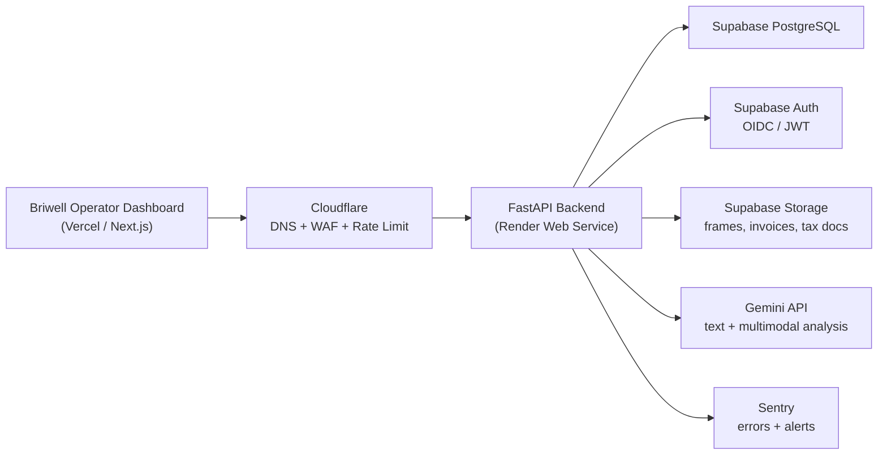

# Briwell Cloud Stack Execution Plan v0

작성일: 2026-06-17

## 1. 최종 추천 결론

Briwell MVP는 아래 조합으로 가는 것이 가장 현실적입니다.

| 영역 | 추천 서비스 | 역할 | 추천 이유 |
|---|---|---|---|
| DB/Auth/Storage | Supabase | PostgreSQL, 로그인, 파일 저장 | 지금 만든 PostgreSQL 구조를 거의 그대로 가져갈 수 있고, Auth와 Storage까지 한 곳에서 시작 가능 |
| Backend API | Render | FastAPI 서버 배포 | Python/FastAPI 배포가 단순하고, 외주 개발자나 AI 개발 흐름에서 이해하기 쉬움 |
| Frontend Dashboard | Vercel | 운영 대시보드 배포 | React/Next.js 계열 대시보드 개발과 배포 경험이 좋음 |
| DNS/WAF/Rate Limit | Cloudflare | 도메인, 보안, API rate limit | 공개 API 앞단에서 남용 방지와 기본 방어선을 세우기 좋음 |
| Error Monitoring | Sentry | 에러 추적, 알림 | 외주/내부 개발 모두 장애 원인 추적이 쉬워짐 |
| AI Provider | Gemini API 중심 | 텍스트/멀티모달 분석 | 영상/이미지/자막 분석과 비용 효율을 우선할 때 현재 MVP 방향과 잘 맞음 |

객관적 판단: 지금 단계에서 AWS 풀스택, Kubernetes, 자체 서버 운영은 과합니다. 개발 속도, 비용, 외주 인수인계, AI-assisted 개발 가능성을 모두 보면 `Supabase + Render + Vercel` 조합이 가장 적절합니다.

## 2. 목표 아키텍처



## 3. 지금 코드에 반영한 내용

이번 단계에서 실제 계정 없이 할 수 있는 운영 전환 준비를 반영했습니다.

1. `AUTH_PROVIDER=oidc` 모드 추가
2. 운영 모드에서 `X-User-Role` 헤더 권한 우회 방지
3. Supabase Auth JWT를 JWKS 공개키로 검증할 수 있는 코드 경로 추가
4. Supabase 권장 OIDC 환경값 추가
5. Render 배포 blueprint 추가
6. 배포 전 readiness CLI 추가
7. placeholder 환경값 차단 로직 추가
8. 인증/운영 readiness 테스트 추가

수정된 핵심 파일:

- `work/briwell_mvp_app/app/core/auth.py`
- `work/briwell_mvp_app/app/core/config.py`
- `work/briwell_mvp_app/app/core/readiness.py`
- `work/briwell_mvp_app/app/routers/ops.py`
- `work/briwell_mvp_app/render.yaml`
- `work/briwell_mvp_app/.env.production.example`
- `work/briwell_mvp_app/scripts/verify_production_readiness.py`
- `work/briwell_mvp_app/tests/test_auth.py`

## 4. Supabase 설정 계획

### 4.1 PostgreSQL

현재 로컬 PostgreSQL schema/migration 구조는 Supabase PostgreSQL로 이전하기 좋습니다.

진행 순서:

1. Supabase 프로젝트 생성
2. Database connection string 확보
3. `DATABASE_URL`을 Render 환경변수로 저장
4. `python scripts/bootstrap_db.py --with-seeds --with-keywords --verify` 실행
5. seed count와 migration 적용 여부 확인

주의:

- Supabase의 직접 DB URL과 pooler URL이 다를 수 있습니다.
- API 서버에서는 보통 pooler URL을 사용하고, migration은 direct connection을 쓰는 방식도 고려합니다.
- 운영 전에는 반드시 backup/restore test 시간을 `BACKUP_RESTORE_TESTED_AT`에 기록합니다.

### 4.2 Auth

Supabase Auth는 운영 로그인 담당입니다. Briwell API는 Supabase에서 발급한 JWT를 검증하고, JWT 안의 `app_metadata.briwell_role` 값을 Briwell 권한으로 사용합니다.

권장 역할:

| Briwell Role | 권한 |
|---|---|
| admin | 시스템 설정, AI 로그, 운영 체크 |
| operator | 후보 수집, 분석, DM 초안 검토 |
| campaign_manager | 캠페인 생성, 계약/정산 관리 |
| viewer | 읽기 전용 |

권장 환경값:

```text
AUTH_PROVIDER=oidc
OIDC_ISSUER_URL=https://<project-ref>.supabase.co/auth/v1
OIDC_AUDIENCE=authenticated
OIDC_JWKS_URL=https://<project-ref>.supabase.co/auth/v1/.well-known/jwks.json
OIDC_ROLE_CLAIM=app_metadata.briwell_role
OIDC_EMAIL_CLAIM=email
OIDC_ALLOWED_ALGORITHMS=ES256,RS256
```

중요: Supabase는 asymmetric signing key와 JWKS discovery endpoint 사용을 권장하는 방향입니다. 운영에서는 shared secret 방식보다 공개키 검증 방식이 더 적합합니다.

### 4.3 Storage

Supabase Storage는 아래 파일에 사용합니다.

- 영상 프레임 샘플
- 인플루언서 계약서
- 세금/증빙 파일
- 캠페인 결과 리포트 첨부자료

DB에는 원본 파일을 넣지 않고, Storage URL 또는 object path만 저장합니다.

## 5. Render 배포 계획

추가한 `render.yaml`은 FastAPI 웹 API를 배포합니다.

Render blueprint 주요 흐름:

1. `pip install -r requirements.txt`
2. `python scripts/verify_production_readiness.py --env-file .env.production`
3. `python scripts/bootstrap_db.py --with-seeds --with-keywords --verify`
4. `uvicorn app.main:app --host 0.0.0.0 --port $PORT`

`env.production.example`은 안내 템플릿입니다. `<project-ref>`, `<password>`,
`<managed-secret-reference>` 같은 placeholder 값은 readiness CLI가 차단하도록
구현했습니다. 실제 Supabase/Render 값을 넣기 전에는 production deploy가 통과하면
안 됩니다.

처음 Render에 설정해야 하는 비밀값:

| Environment Variable | 값 |
|---|---|
| `DATABASE_URL` | Supabase PostgreSQL URL |
| `OIDC_ISSUER_URL` | Supabase Auth issuer |
| `OIDC_JWKS_URL` | Supabase JWKS endpoint |
| `GEMINI_API_KEY` | Google Gemini API key |
| `BACKUP_RESTORE_TESTED_AT` | restore test 완료 시각 |

## 6. Vercel 대시보드 계획

대시보드는 다음 단계에서 React/Next.js로 만드는 것을 추천합니다.

첫 화면은 랜딩 페이지가 아니라 운영 화면이어야 합니다.

필수 화면:

1. Candidate Inbox: 후보 인플루언서 목록, 점수, 국가, 리스크 필터
2. Creator Detail: 프로필, 영상, 댓글 샘플, AI 분석 근거
3. Campaign Builder: 국가/제품/예산/목표 생성
4. DM Review Queue: DM 초안, claims check, 승인/반려
5. Execution Tracker: DM sent, replied, negotiating, accepted, posted 상태
6. Performance: 쿠폰, URL, 조회수, 매출, ROAS
7. Settlement: 계약, 납품, invoice, payout status

## 7. Cloudflare 보안 계획

Cloudflare는 API와 대시보드 앞단의 기본 방어선입니다.

초기 규칙:

1. `/ops/*`는 관리자 IP 또는 강한 인증 뒤에서만 접근
2. `/ai/*`, `/analysis-jobs/*`는 rate limit 적용
3. 로그인/API brute-force 방어
4. 불필요 국가/봇 트래픽 제한은 실제 데이터 보고 적용

## 8. Sentry 운영 계획

초기에는 아래 이벤트만 잡아도 충분합니다.

1. API 5xx
2. Gemini provider error
3. DB connection error
4. migration/bootstrap failure
5. payout/settlement mutation error
6. claims check failure 급증

추가 구현 시 `sentry-sdk[fastapi]`를 붙이면 됩니다.

## 9. 3회 객관 검수

### 1차 검수: 외주/AI 개발 이어받기 적합성

판정: 적합

이유:

- PostgreSQL, FastAPI, React/Next.js는 외주 개발자 풀이 넓습니다.
- Supabase/Render/Vercel은 설정이 비교적 단순해 AI 개발 보조와 궁합이 좋습니다.
- 로컬 portable DB에서 managed DB로 이동하는 경로가 명확합니다.

보완점:

- GitHub 저장소 초기화와 branch 전략이 아직 필요합니다.
- API 문서와 프론트엔드 타입 생성 자동화가 다음 단계에서 필요합니다.

### 2차 검수: 보안/운영 리스크

판정: 이전보다 크게 개선, 아직 운영 계정 설정 전

개선된 점:

- OIDC 모드에서 header RBAC 우회를 차단했습니다.
- JWT 검증은 issuer/audience/JWKS/algorithm 기준으로 설계했습니다.
- 배포 전 readiness check가 blockers를 반환합니다.
- placeholder 환경값을 운영 준비 완료로 오판하지 않게 막았습니다.

남은 점:

- 실제 Supabase 프로젝트에서 asymmetric signing key 설정 확인 필요
- Cloudflare rate limit 실제 룰 생성 필요
- Sentry 연동 및 알림 채널 설정 필요

### 3차 검수: 비용/확장성/복잡도

판정: MVP에 적합

이유:

- 초반에는 작은 유료 플랜 조합으로 시작 가능
- DB/Auth/API/Frontend가 분리되어 나중에 병목만 개별 확장 가능
- AWS/Kubernetes 대비 초기 운영 부담이 낮음

주의:

- AI 비용은 Gemini 호출 로그와 budget alert를 반드시 붙여야 합니다.
- 멀티모달 분석은 전 후보에 돌리지 말고, 1차 필터 통과 후보에게만 실행해야 합니다.
- 백그라운드 queue는 실제 작업량이 생길 때 Render Worker 또는 별도 queue로 확장합니다.

## 10. 다음 실행 순서

다음 단계는 실제 계정 연결 전후로 나뉩니다.

### 계정 연결 전, 코드로 더 할 수 있는 일

1. 프론트엔드 대시보드 scaffold 생성
2. API client/type generation 구조 만들기
3. Sentry SDK scaffold 추가
4. Storage object path schema 추가
5. AI 비용 예산/로그 대시보드 API 추가

### 계정 연결 후 해야 할 일

1. Supabase 프로젝트 생성
2. Supabase Auth role metadata 정책 확정
3. Render 서비스 생성 및 환경변수 입력
4. DB migration/seed 실행
5. Cloudflare domain/rate limit 연결
6. Vercel dashboard 배포
7. Sentry 프로젝트 생성 및 DSN 연결

## 11. 참고한 공식 문서

- Supabase JWT signing keys and JWKS: https://supabase.com/docs/guides/auth/signing-keys
- Render Blueprint YAML reference: https://render.com/docs/blueprint-spec
- Render FastAPI deployment: https://render.com/docs/deploy-fastapi
- Cloudflare WAF rate limiting rules: https://developers.cloudflare.com/waf/rate-limiting-rules/
- Vercel full-stack framework support: https://vercel.com/docs/frameworks/full-stack
