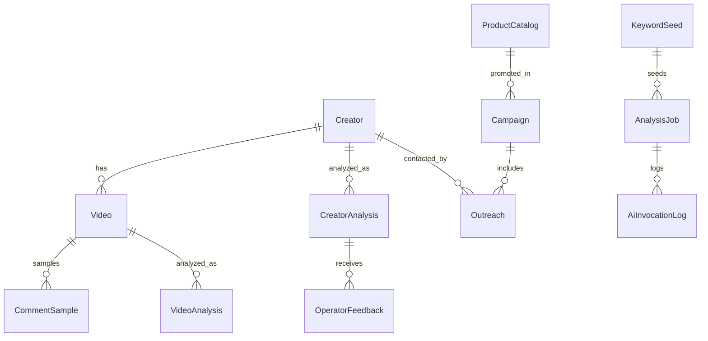

# Briwell Influencer Intelligence MVP v0.1 PRD

작성일: 2026-06-17  
대상 국가: 멕시코, 페루, 에콰도르  
사업 목적: 한국 화장품의 중남미 B2C 온라인 판매를 위한 TikTok 기반 인플루언서 발굴, 분석, 검증, 아웃리치 자동화
문서 상태: MVP v0.1 기획안, 3차 QA 반영본

## 1. Executive Summary

Briwell MVP v0.1은 멕시코, 페루, 에콰도르의 TikTok 뷰티 인플루언서를 Low/Medium Risk 소스 기반으로 수집하고, Gemini 중심 AI 파이프라인으로 프로필, 영상, 댓글, 브랜드 적합도, 협업 가능성을 분석한 뒤, 최적 후보를 랭킹하고 스페인어 DM 초안을 생성하는 내부 운영툴이다.

핵심 방향은 "조회수가 높은 사람"을 찾는 것이 아니라, "브리웰이 유통하는 K-뷰티 제품을 실제로 팔 가능성이 높은 사람"을 찾는 것이다.

초기 버전은 완전 자동 캠페인 운영이 아니라, AI가 후보를 압축하고 근거를 제시하며 운영자가 빠르게 검수, 승인, 발송할 수 있게 만드는 반자동 시스템으로 설계한다.

### 1.1 Product Thesis

Briwell의 초기 B2C 성장은 대형 셀럽보다 국가별 마이크로/미드 뷰티 크리에이터를 반복적으로 발굴하고, 제품별로 맞는 협업 앵글을 빠르게 테스트하는 능력에서 나온다. 따라서 MVP의 가치는 "완벽한 자동화"가 아니라 "좋은 후보를 더 빨리, 더 싸게, 더 일관되게 찾는 운영 시스템"이다.

## 2. Product Goals

### 2.1 Business Goals

1. 멕시코, 페루, 에콰도르에서 K-뷰티 바이럴 캠페인에 적합한 TikTok 인플루언서 후보 DB를 구축한다.
2. 국가별, 제품군별, 캠페인 목적별로 협업 가능성이 높은 인플루언서를 빠르게 찾는다.
3. 인플루언서 분석, 분류, DM 초안 작성에 드는 운영 시간을 줄인다.
4. 캠페인 응답률, 게시율, 조회수, 쿠폰 사용, 판매 성과 데이터를 축적해 Briwell 고유의 인플루언서 성과 데이터 자산을 만든다.

### 2.2 MVP Goals

MVP v0.1의 목표는 다음이다.

1. Low/Medium Risk 소스만 사용해 멕시코 1,000명, 페루 500명, 에콰도르 300명 규모의 후보 DB를 만들 수 있는 구조를 구축한다.
2. 후보 중 상위 20%는 AI 상세 분석, 상위 5%는 멀티모달 심층 분석을 수행한다.
3. 최종 후보별 추천 이유, 추천 제품, 협업 앵글, 리스크, DM 초안을 자동 생성한다.
4. 운영자가 대시보드에서 검색, 필터링, 후보 검수, DM 상태 관리를 할 수 있게 한다.

### 2.3 Pilot Hypotheses

MVP 파일럿에서 검증할 가설:

1. 팔로워 수보다 댓글 품질, 구매 의도 댓글, 제품 시연력, 현지성 점수가 협업 성과를 더 잘 예측한다.
2. 멕시코는 커머스형 크리에이터, 페루는 피부 고민/루틴형 크리에이터, 에콰도르는 UGC/마이크로 크리에이터에서 초기 효율이 높다.
3. Gemini 중심 분석 funnel을 사용하면 상위 후보 검수 시간을 수동 리서치 대비 50% 이상 줄일 수 있다.
4. AI가 생성한 개인화 DM 초안은 운영자가 처음부터 작성한 메시지보다 초안 작성 시간을 70% 이상 줄인다.

### 2.4 MVP Success Targets

MVP v0.1 성공 기준:

1. Low/Medium Risk 소스 기반 3개국 합산 후보 1,800명 이상 등록
2. AI 상세 분석 후보 360명 이상
3. 멀티모달 분석 후보 90명 이상
4. 운영자 승인 후보 60명 이상
5. 1차 아웃리치 55명 이상
6. DM 응답률 10% 이상
7. 샘플/협업 논의 전환율 5% 이상
8. 승인 후보 1명당 AI 분석 비용이 사전 예산 한도 이내

후보 등록 기준:

1. `Creator` 기본 프로필, 국가, 플랫폼 URL, source metadata가 있으면 후보 등록으로 인정한다.
2. 댓글, 영상 프레임, 음성 전사는 모든 후보에게 필수 등록 요건이 아니다.
3. 댓글/영상/전사 데이터는 Low/Medium Risk 경로로 확보된 경우에만 분석한다.

## 3. Non-Goals

MVP v0.1에서 하지 않는 것:

1. TikTok DM 완전 자동 대량 발송
2. 실시간 캠페인 정산 자동화
3. 계약서 자동 생성 및 전자서명
4. TikTok Shop 직접 주문 연동
5. 인플루언서 단가 자동 협상
6. 모든 중남미 국가 확장
7. 모든 영상의 전체 원본 멀티모달 분석
8. 비인가 크롤링, 로그인 우회, 캡차 우회, 비공개 데이터 수집을 제품 기능으로 전제하지 않음
9. High Risk 수집 경로를 MVP v0.1에서 실행하지 않음

초기에는 브랜드 리스크와 플랫폼 정책 리스크를 줄이기 위해 "AI 추천 + 사람 승인" 구조를 유지한다.

## 4. Target Users

### 4.1 Internal Operator

Briwell 내부 마케팅/운영 담당자.

주요 작업:

1. 국가별 인플루언서 후보 검색
2. AI 추천 후보 검수
3. DM 초안 확인 및 수정
4. 아웃리치 상태 관리
5. 캠페인 후보 리스트 저장

### 4.2 Campaign Manager

캠페인 성과와 예산을 관리하는 담당자.

주요 작업:

1. 제품군별 추천 인플루언서 확인
2. 예상 성과와 리스크 비교
3. 캠페인 후보 확정
4. 실제 응답률, 게시율, 매출 성과 확인

### 4.3 Admin

시스템 설정과 데이터 품질을 관리하는 담당자.

주요 작업:

1. 국가별 키워드 사전 관리
2. 제품군별 매칭 기준 관리
3. AI 분석 기준과 프롬프트 버전 관리
4. 데이터 수집 작업 상태 확인

### 4.4 Roles and Permissions

권한 구조:

| Role | Permissions |
|---|---|
| Admin | 키워드/제품/스코어링/모델 설정, 수집 작업 승인, 사용자 권한 관리 |
| Operator | 후보 검수, DM 초안 수정, 아웃리치 상태 변경, 운영자 메모 작성 |
| Campaign Manager | 캠페인 생성, 후보 승인, 예산/성과 확인, 최종 협업 후보 확정 |
| Viewer | 대시보드와 리포트 조회만 가능 |

모든 DM 발송 승인, 수집 작업 승인, 점수 수동 수정은 audit log에 기록한다.

## 5. Core Workflow

```text
국가/제품/키워드 설정
-> 승인된 소스 기반 후보 수집
-> 1차 룰 기반 필터링
-> Gemini 대량 텍스트 분석
-> 댓글/캡션/프로필 분석
-> 상위 후보 멀티모달 분석
-> 점수 계산
-> 상위 후보 리포트 생성
-> DM 초안 생성 및 승인 대기
-> 운영자 검수
-> 아웃리치 상태 관리
-> 캠페인 결과 피드백
```

## 6. Country Strategy

### 6.1 Mexico

역할: 1차 전환 실험 시장

전략:

1. TikTok 커머스 친화 크리에이터 우선
2. 제품 리뷰, 쿠폰, 링크, 라이브 경험이 있는 계정 우선
3. 선크림, 진정 세럼, 마스크팩, 색조 제품 테스트
4. 전환 경로는 TikTok Shop 가능성을 확인하되, 초기에는 Shopify/Mercado Libre/쿠폰 링크도 병행 검토

초기 목표:

1. 후보 1,000명
2. AI 상세 분석 200명
3. 최종 검수 50명
4. 1차 DM 30명

### 6.2 Peru

역할: 스페인어권 확장성 검증 시장

전략:

1. 뷰티 루틴, 피부 고민, 제품 리뷰 중심 크리에이터 우선
2. 외부몰, Instagram, WhatsApp 전환 가능성 확인
3. 여드름, 잡티, 민감성, 보습 제품군 테스트
4. 전환 경로는 외부몰, Instagram DM, WhatsApp, 현지 리셀러 링크를 우선 검토

초기 목표:

1. 후보 500명
2. AI 상세 분석 100명
3. 최종 검수 25명
4. 1차 DM 15명

### 6.3 Ecuador

역할: 저비용 파일럿 시장

전략:

1. 마이크로 인플루언서와 UGC 제작자 중심
2. 낮은 협업 단가로 콘텐츠 제작 실험
3. 제품 후기형, 언박싱형, 루틴형 콘텐츠 검증
4. 전환 경로는 Instagram/WhatsApp 문의와 외부몰 링크 중심으로 검토

초기 목표:

1. 후보 300명
2. AI 상세 분석 60명
3. 최종 검수 15명
4. 1차 DM 10명

## 7. Product Categories

MVP에서 우선 지원할 제품군:

1. Sunscreen
   - 스페인어 키워드: protector solar, bloqueador, SPF, piel grasa, piel sensible
   - 추천 콘텐츠: 사용감 리뷰, 백탁 테스트, 외출 루틴

2. Calming Serum
   - 스페인어 키워드: serum calmante, piel sensible, rojeces, barrera de la piel
   - 추천 콘텐츠: 민감성 피부 루틴, 진정 루틴, 사용 전후

3. Sheet Mask
   - 스페인어 키워드: mascarilla coreana, mascarilla facial, hidratacion, glow
   - 추천 콘텐츠: 언박싱, 셀프케어 루틴, 야간 루틴

4. Cushion/Foundation
   - 스페인어 키워드: cushion coreano, base ligera, maquillaje coreano, glass skin
   - 추천 콘텐츠: 메이크업 튜토리얼, 지속력 테스트, 커버력 테스트

5. Cleanser
   - 스페인어 키워드: limpiador facial, doble limpieza, aceite limpiador, piel acneica
   - 추천 콘텐츠: 세안 루틴, 트러블 피부 루틴, 메이크업 제거 테스트

## 8. AI Strategy

### 8.1 Final AI Stack

MVP의 기본 AI 전략은 Gemini 중심이다.

```text
대량 후보 분석: gemini-3.1-flash-lite
영상/이미지/댓글 멀티모달 분석: gemini-3-flash
상위 후보 최종 검수: gemini-3.5-flash
음성 전사: gpt-4o-mini-transcribe
브랜드 세이프티: omni-moderation-latest
텍스트 임베딩: text-embedding-3-small
멀티모달 임베딩: gemini-embedding-2
Claude: MVP v0.1 제외
```

### 8.2 Why Gemini-Centered

Gemini를 중심으로 쓰는 이유:

1. 영상, 이미지, 텍스트, 오디오 입력 비용이 상대적으로 낮다.
2. TikTok 콘텐츠 분석은 멀티모달 이해가 핵심이다.
3. 대량 후보 분석과 상위 후보 심층 분석을 같은 모델 패밀리에서 처리할 수 있다.
4. Batch/Flex 처리로 비용을 줄일 수 있다.
5. 스페인어권 텍스트와 시각 콘텐츠를 함께 분석하기에 적합하다.

### 8.3 Why Not Gemini Only

완전 단독 Gemini만 쓰지 않는 이유:

1. 음성 전사는 GPT-4o-mini-transcribe가 분당 비용과 품질 측면에서 유리하다.
2. OpenAI moderation endpoint는 텍스트/이미지 안전 필터에 비용 효율이 매우 좋다.
3. 텍스트 검색/클러스터링은 text-embedding-3-small이 단순하고 검증된 선택이다.
4. AI 제공사 장애나 품질 이슈에 대비해 최소한의 보조 경로를 남기는 것이 안전하다.

### 8.4 AI Usage by Stage

| Stage | Task | Primary AI | Fallback | Notes |
|---|---|---|---|---|
| Discovery | 키워드 확장, 해시태그 분류 | Gemini 3.1 Flash-Lite | Gemini 3 Flash | 국가별 스페인어 표현 확장 |
| Profile Analysis | bio, 링크, 협찬 흔적 추출 | Gemini 3.1 Flash-Lite | Configured low-cost OpenAI model | JSON 구조화 출력 |
| Comment Analysis | 구매 의도, 질문, 감성 분석 | Gemini 3.1 Flash-Lite Batch | Gemini 3 Flash | 댓글 전체가 아니라 샘플링 |
| Transcript | 영상 음성 전사 | GPT-4o-mini-transcribe | Gemini audio input | 짧은 영상 중심 |
| Multimodal | 프레임, 제품 사용 장면 분석 | Gemini 3 Flash | Gemini 3.5 Flash | 상위 후보만 분석 |
| Final Review | 최종 후보 종합 검수 | Gemini 3.5 Flash | GPT-5.5 | 상위 5%만 |
| Safety | 위험 콘텐츠 필터 | omni-moderation-latest | Gemini safety settings | 텍스트/이미지 대상 |
| DM Draft | 개인화 DM 생성 | Gemini 3 Flash | Gemini 3.5 Flash | 3개 버전 생성 |
| VIP Proposal | 고액 후보 제안서 | Gemini 3.5 Flash | GPT-5.5 or Claude | MVP에서는 선택 기능 |

모델명은 코드에 하드코딩하지 않는다. 모든 모델은 `AiModelConfig`에서 provider, model_id, task_type, fallback, 가격 검증일을 관리한다.

### 8.5 Initial Model Registry

초기 모델 레지스트리 기본값:

| Alias | Provider | Model ID | Task | Mode |
|---|---|---|---|---|
| low_cost_text | Google | gemini-3.1-flash-lite | 키워드, 프로필, 댓글 대량 분석 | Batch/Flex 우선 |
| multimodal_default | Google | gemini-3-flash | 영상 프레임, 이미지, 짧은 오디오/텍스트 통합 분석 | Batch 우선 |
| final_review | Google | gemini-3.5-flash | 상위 후보 종합 판단, 고신뢰 리포트 | Standard or Batch |
| transcription_default | OpenAI | gpt-4o-mini-transcribe | TikTok 영상 음성 전사 | Standard |
| moderation_default | OpenAI | omni-moderation-latest | 텍스트/이미지 브랜드 세이프티 | Standard |
| text_embedding | OpenAI | text-embedding-3-small | 텍스트 검색, 중복 제거, 클러스터링 | Standard |
| multimodal_embedding | Google | gemini-embedding-2 | 텍스트/이미지/영상/오디오 통합 검색 | Batch 가능 시 우선 |

### 8.6 AI Quality Gates

AI 출력 품질 기준:

1. 모든 AI 분석 결과는 JSON schema validation을 통과해야 저장된다.
2. 모든 추천에는 `ai_evidence`가 있어야 하며, 근거 없는 요약은 최종 리포트에 노출하지 않는다.
3. `score_confidence`가 0.7 미만이면 자동으로 `review_required_reason`을 생성하고 운영자 검수 큐로 보낸다.
4. 미성년자 의심, 의료적 효능 주장, 논란/혐오/성적 콘텐츠, 가짜 반응 의심은 자동 승인 대상에서 제외한다.
5. DM/제안서 생성은 허용 표현/금지 표현 체크를 통과해야 한다.
6. 운영자가 수정한 점수, 세그먼트, DM 문안은 학습용 피드백 데이터로 저장한다.

## 9. Data Collection Strategy

### 9.1 Data Source Principles

데이터 수집은 플랫폼 정책과 계정 리스크를 고려한다.

원칙:

1. 공식 API, 승인된 데이터 제공자, Creator Marketplace류의 합법적 도구, 수동 리서치, 사용자가 제공한 CSV를 우선한다.
2. MVP v0.1에서는 Low, Low to Medium, Medium Risk 소스만 허용한다.
3. High Risk 수집 경로는 MVP v0.1에서 실행하지 않으며, v0.2 이후 별도 PRD와 법무/정책 검토가 있을 때만 재검토한다.
4. 로그인 우회, 캡차 우회, 비공개 데이터 접근, 삭제된 콘텐츠 재수집은 금지한다.
5. DM 자동 대량 발송은 금지하고, AI 초안 생성 후 사람이 승인한다.
6. 수집 데이터에는 `source_type`, `source_url`, `collected_at`, `source_risk_level`, `last_verified_at`을 기록한다.
7. 삭제 요청, 비공개 전환, 연락 거부, 미성년자 의심 계정은 분석/아웃리치 제외 상태로 전환할 수 있어야 한다.
8. 민감정보를 직접 추론하거나 타겟팅 기준으로 사용하지 않는다.

### 9.2 Seed Inputs

운영자가 설정하는 입력값:

1. 국가: Mexico, Peru, Ecuador
2. 제품군: sunscreen, serum, sheet_mask, cushion, cleanser
3. 키워드: K-beauty, skincare, maquillaje coreano 등
4. 해시태그: #kbeauty, #skincare, #maquillaje, #rutinafacial 등
5. 최소 팔로워 수
6. 최소 평균 조회수
7. 최근 활동 기간

### 9.3 Candidate Sources

후보 발굴 경로:

1. Low Risk: 수동 업로드 CSV, 기존 캠페인 응답자 DB, 인플루언서가 직접 제공한 미디어킷
2. Low to Medium Risk: 공식 API, 승인된 데이터 제공자, Creator Marketplace류의 플랫폼 내 검색/내보내기 기능
3. Medium Risk: TikTok 공개 검색 결과, 공개 해시태그 페이지, 공개 프로필 수동 리서치
4. Medium Risk: Instagram/YouTube 교차 확인, 공개 링크 기반 연락처 확인
5. Out of Scope for MVP v0.1: 자동화된 공개 페이지 수집, 대량 영상 메타데이터 수집, 대량 댓글 샘플링
6. Not Allowed: 로그인 우회, 캡차 우회, 비공개 데이터 수집, 삭제 콘텐츠 보관, 자동 DM 발송

MVP v0.1에서는 1-4번 경로만 허용한다. 5번은 v0.1에서 실행하지 않고, 6번은 제품 기능으로 만들지 않는다.

### 9.4 Data Governance and Retention

데이터 거버넌스 원칙:

1. 모든 데이터는 `source_type`, `source_url`, `source_risk_level`, `collected_at`, `last_verified_at`을 가져야 한다.
2. `source_risk_level = High` 데이터는 MVP v0.1에서 신규 생성할 수 없다. 예외적으로 과거 마이그레이션 데이터에 존재하면 quarantine 상태로 저장하고 검색/분석/아웃리치에서 제외한다.
3. `do_not_contact = true` 또는 `removal_requested_at is not null`인 크리에이터는 검색 결과에서 기본 제외한다.
4. 연락처 정보는 아웃리치 목적 외 사용을 금지하고, 접근 권한을 Admin/Operator 역할로 제한한다.
5. 댓글 샘플은 분석 목적의 최소량만 저장하고, 원문 전체 저장을 기본값으로 하지 않는다.
6. 댓글 샘플은 공식 API, 승인된 데이터 제공자, Creator Marketplace류의 합법적 도구, 수동 리서치, 인플루언서 제공 자료에서만 가져온다.
7. 영상 프레임/전사 분석은 승인된 소스에서 접근 가능한 영상 또는 크리에이터/운영자가 제공한 자료에만 수행한다.
8. 콘텐츠가 삭제되거나 비공개로 전환된 것이 감지되면 `content_available = false`로 표시하고 재분석을 중단한다.
9. 데이터 보관 기간은 파일럿 기준 12개월을 기본값으로 하고, 법무/운영 정책에 따라 조정한다.
10. 플랫폼 약관, 국가별 개인정보 규정, 화장품 광고 표현 규정은 배포 전 별도 체크리스트로 확인한다.

### 9.5 Collection Approval Gate

수집 작업 실행 전 필요한 승인:

1. Low Risk: Admin 설정만으로 실행 가능
2. Low to Medium Risk: Admin 승인 후 실행
3. Medium Risk: Admin 승인 + 수집량 제한 + 로그 기록 필수
4. High Risk: MVP v0.1에서 실행 불가. v0.2 이후 별도 PRD, 법무/정책 검토, 대표 승인 필요
5. Not Allowed: 시스템에서 실행 불가

## 10. AI Analysis Schema

### 10.1 Creator Profile Analysis

AI가 추출할 필드:

```json
{
  "creator_type": "beauty_reviewer | makeup_artist | skincare_educator | lifestyle | commerce_creator | ugc_creator | unknown",
  "primary_country": "MX | PE | EC | unknown",
  "language": "es | pt | en | mixed",
  "beauty_relevance": 0,
  "contact_available": true,
  "contact_channels": ["email", "instagram", "tiktok", "whatsapp"],
  "sponsorship_experience": "none | likely | confirmed",
  "risk_notes": [],
  "confidence": 0,
  "evidence": [],
  "summary": ""
}
```

### 10.2 Video Analysis

AI가 추출할 필드:

```json
{
  "content_format": "review | tutorial | routine | unboxing | before_after | live_clip | meme | educational | other",
  "product_categories": ["sunscreen", "serum", "mask", "makeup", "cleanser"],
  "visual_quality_score": 0,
  "product_demo_quality_score": 0,
  "trust_signal_score": 0,
  "commerce_signal_score": 0,
  "kbeauty_fit_score": 0,
  "brand_safety_flags": [],
  "confidence": 0,
  "notable_scenes": [],
  "recommended_briwell_angle": ""
}
```

### 10.3 Comment Analysis

AI가 추출할 필드:

```json
{
  "positive_sentiment_ratio": 0,
  "negative_sentiment_ratio": 0,
  "purchase_intent_comments": 0,
  "where_to_buy_comments": 0,
  "price_questions": 0,
  "skin_concern_questions": 0,
  "spam_or_low_quality_ratio": 0,
  "representative_comments": [],
  "confidence": 0,
  "insights": ""
}
```

## 11. Scoring System

### 11.1 Score Dimensions

최종 점수는 AI가 임의로 하나의 점수를 만들지 않는다. 각 항목별 점수를 계산하고, 시스템이 가중합으로 최종 점수를 만든다.

| Score | Weight | Description |
|---|---:|---|
| Beauty Fit | 25% | K-뷰티, 스킨케어, 색조, 피부 고민 콘텐츠 적합도 |
| Engagement Quality | 20% | 댓글 품질, 질문 비율, 구매 의도, 팔로워 대비 조회수 |
| Audience Locality | 15% | 멕시코/페루/에콰도르 현지성 |
| Commerce Intent | 15% | 쿠폰, 링크, 리뷰, 라이브, 제품 태그 경험 |
| Content Quality | 10% | 영상 퀄리티, 설명력, 제품 시연력 |
| Collaboration Probability | 10% | 연락 가능성, 협찬 경험, 응답 가능성 |
| Cost Efficiency | 5% | 예상 단가, 샘플 제공 가능성, 예상 성과 대비 비용 효율 |
| Risk Adjustment | 0 to -30 pts | 과장 광고, 논란, 저품질 댓글, 브랜드 세이프티 리스크 |

### 11.2 Final Score Formula

```text
Base Score =
Beauty Fit * 0.25
+ Engagement Quality * 0.20
+ Audience Locality * 0.15
+ Commerce Intent * 0.15
+ Content Quality * 0.10
+ Collaboration Probability * 0.10
+ Cost Efficiency * 0.05

Final Score = clamp(Base Score - Risk Penalty, 0, 100)
```

Base Score는 100점 만점으로 정규화한다. `Risk Penalty`는 0-30점 차감값으로 관리해 점수 산식과 리스크 판단 근거를 분리한다.

### 11.3 Segment Classification

최종 분류:

1. Viral Micro
   - 팔로워는 작지만 최근 조회수 상승률이 높음

2. Beauty Educator
   - 성분, 피부 고민, 루틴 설명력이 좋음

3. Review Creator
   - 제품 사용 후기, 언박싱, 전후 비교에 강함

4. Commerce Creator
   - 쿠폰, 링크, 라이브, 구매 유도 경험이 있음

5. Brand Builder
   - 이미지와 신뢰도가 높고 브랜드 론칭에 적합

6. UGC Creator
   - 계정 파급력보다 광고 소재 제작에 적합

7. Avoid
   - 브랜드 핏 낮음, 위험도 높음, 댓글 품질 낮음

## 12. Dashboard Requirements

### 12.1 Home Dashboard

표시 항목:

1. 국가별 후보 수
2. 분석 완료 후보 수
3. 상위 후보 수
4. DM 발송 대기 수
5. 응답 수
6. 캠페인 진행 후보 수

### 12.2 Creator Search

필터:

1. 국가
2. 최종 점수
3. 세그먼트
4. 제품군 적합도
5. 팔로워 범위
6. 평균 조회수
7. 댓글 품질
8. 리스크 등급
9. 연락처 있음/없음
10. 아웃리치 상태

리스트 컬럼:

1. creator username
2. country
3. segment
4. follower count
5. average views
6. engagement quality
7. recommended product
8. final score
9. risk level
10. outreach status

### 12.3 Creator Detail

상세 화면 구성:

1. 기본 프로필
2. AI 요약
3. 추천 제품군
4. 추천 협업 앵글
5. 최근 영상 성과
6. 댓글 분석
7. 멀티모달 영상 분석
8. 점수 breakdown
9. 리스크 노트
10. DM 초안
11. 운영자 메모
12. 아웃리치 히스토리

### 12.4 Outreach CRM

상태값:

1. Discovered
2. Reviewing
3. Approved
4. Contact Found
5. DM Drafted
6. DM Sent
7. Replied
8. Negotiating
9. Accepted
10. Sample Sent
11. Content Posted
12. Completed
13. Rejected
14. Paused

### 12.5 AI Review Queue

운영자가 검수해야 하는 항목:

1. AI 추천 상위 후보
2. 리스크 플래그 후보
3. DM 발송 전 후보
4. 제품 매칭이 애매한 후보
5. 고액 협업 예상 후보

## 13. DM Automation

### 13.1 DM Principles

1. 완전 자동 발송하지 않는다.
2. AI는 초안을 만들고, 운영자가 승인한다.
3. 국가별 표현 차이를 반영한다.
4. 인플루언서의 실제 콘텐츠를 언급한다.
5. 첫 메시지는 짧고 자연스럽게 쓴다.
6. 과장된 매출 약속이나 의학적 표현을 피한다.

### 13.2 DM Variants

AI가 생성할 DM 버전:

1. Soft Intro
   - 자연스러운 첫 연락

2. Product Review Proposal
   - 제품 리뷰 협업 제안

3. UGC Collaboration
   - 콘텐츠 제작 중심 제안

4. Commerce Collaboration
   - 쿠폰/커미션/링크 중심 제안

### 13.3 Spanish DM Template

```text
Hola {creator_name}, soy {manager_name} de Briwell, una distribuidora de K-beauty.

Vimos tu contenido sobre {content_topic} y nos gusto mucho como explicas {specific_strength}.
Creemos que tu estilo encaja muy bien con una colaboracion de {product_category}.

Nos gustaria enviarte mas detalles sobre una posible colaboracion con productos coreanos.
Te interesaria que te compartamos la propuesta?
```

### 13.4 Follow-Up Template

```text
Hola {creator_name}, solo queria dar seguimiento a mi mensaje anterior.

Creemos que tu comunidad podria conectar muy bien con una rutina de K-beauty enfocada en {product_angle}.
Si te interesa, puedo enviarte una propuesta breve con productos, formato y condiciones.
```

### 13.5 DM and Claims Guardrails

DM/제안서 금지 사항:

1. 여드름, 기미, 피부염 등 질환 치료를 보장하는 표현
2. "100% 효과", "완치", "의학적으로 보장" 같은 과장 표현
3. 확정되지 않은 수익, 매출, 조회수 보장
4. 미성년자에게 직접 구매를 유도하는 표현
5. 협찬 표기나 광고 고지를 회피하도록 유도하는 표현
6. 수신 거부 의사를 밝힌 크리에이터에게 후속 연락하는 행위

DM 생성 결과는 발송 전 `claims_check_status = passed`여야 한다.

## 14. Data Model

### 14.1 Creator

```text
id
platform
platform_creator_id
country
username
display_name
profile_url
bio
language
follower_count
following_count
total_likes
contact_email
instagram_url
whatsapp
external_links
category_tags
source_type
source_url
source_risk_level
collected_at
first_seen_at
last_synced_at
last_verified_at
do_not_contact
removal_requested_at
status
```

### 14.2 Video

```text
id
creator_id
platform_video_id
url
caption
hashtags
posted_at
view_count
like_count
comment_count
share_count
save_count
duration_seconds
thumbnail_url
transcript
raw_metadata
source_type
source_url
source_risk_level
collected_at
content_available
deletion_detected_at
last_synced_at
```

### 14.3 CommentSample

```text
id
video_id
comment_text
comment_language
like_count
reply_count
sentiment
purchase_intent
question_type
sample_method
source_risk_level
contains_sensitive_data
collected_at
created_at
sampled_at
```

### 14.4 CreatorAnalysis

```text
id
creator_id
analysis_version
beauty_fit_score
engagement_quality_score
audience_locality_score
commerce_intent_score
content_quality_score
collaboration_probability_score
cost_efficiency_score
risk_score
risk_penalty
final_score
segment
recommended_products
recommended_campaign_angle
ai_summary
ai_evidence
score_confidence
review_required_reason
created_at
```

### 14.5 VideoAnalysis

```text
id
video_id
analysis_version
content_format
product_categories
visual_quality_score
product_demo_quality_score
trust_signal_score
commerce_signal_score
kbeauty_fit_score
frame_analysis
notable_scenes
created_at
```

### 14.6 Outreach

```text
id
creator_id
campaign_id
status
dm_variant
dm_message
claims_check_status
generated_model_config_id
approved_by_user_id
channel
sent_at
last_contacted_at
do_not_contact_checked_at
response_received_at
response_summary
proposed_terms
operator_notes
created_at
updated_at
```

### 14.7 Campaign

```text
id
name
product_id
country
product_category
campaign_goal
budget
sales_channel
tracking_url
coupon_code_prefix
target_creator_count
target_post_count
start_date
end_date
status
created_at
updated_at
```

### 14.9 ProductCatalog

```text
id
brand_name
product_name
product_category
country_availability
key_claims_allowed
claims_disallowed
target_skin_concerns
price_range
sample_available
landing_url
status
created_at
updated_at
```

### 14.10 KeywordSeed

```text
id
country
language
keyword
hashtag
product_category
intent_type
priority
status
created_at
updated_at
```

### 14.11 ScoringRule

```text
id
rule_version
score_dimension
weight
min_value
max_value
calculation_notes
active
created_at
updated_at
```

### 14.12 AnalysisJob

```text
id
job_type
status
source_risk_level
approval_required
approved_by_user_id
started_at
completed_at
error_message
input_count
success_count
failed_count
estimated_cost_usd
actual_cost_usd
created_at
updated_at
```

### 14.13 AiInvocationLog

```text
id
analysis_job_id
model_config_id
target_entity_type
target_entity_id
prompt_version
input_token_count
output_token_count
cost_usd
latency_ms
status
error_message
created_at
```

### 14.14 OperatorFeedback

```text
id
creator_id
analysis_id
user_id
feedback_type
original_value
corrected_value
notes
created_at
```

### 14.15 AuditLog

```text
id
user_id
action_type
entity_type
entity_id
before_value
after_value
ip_address
created_at
```

### 14.16 Entity Relationships



### 14.8 AiModelConfig

```text
id
provider
model_alias
model_id
task_type
default_for_task
fallback_model_id
input_price_per_mtok
output_price_per_mtok
batch_supported
flex_supported
context_window
last_price_verified_at
last_capability_verified_at
status
created_at
updated_at
```

## 15. API and Backend Requirements

### 15.1 Backend Services

1. Collector Service
   - 후보 수집, 영상 메타데이터 저장, 댓글 샘플 저장

2. AI Analysis Service
   - 프로필 분석, 댓글 분석, 영상 분석, 최종 검수

3. Scoring Service
   - 점수 계산, 세그먼트 분류, 추천 제품 매칭

4. Outreach Service
   - DM 생성, 상태 관리, 응답 요약

5. Admin Service
   - 키워드, 제품군, 프롬프트, 점수 가중치 관리

### 15.2 Suggested Endpoints

```text
GET /creators
GET /creators/{id}
POST /creators/import
POST /creators/{id}/analyze
POST /creators/batch-analyze

GET /videos
POST /videos/{id}/analyze

GET /campaigns
POST /campaigns
GET /campaigns/{id}/candidates

POST /outreach/{creator_id}/generate-dm
PATCH /outreach/{id}/status

GET /products
POST /products
GET /keywords
POST /keywords
GET /analysis-jobs
POST /analysis-jobs
GET /ai-invocation-logs
POST /operator-feedback

GET /admin/scoring-rules
PATCH /admin/scoring-rules
```

## 16. Technical Stack

권장 스택:

```text
Frontend: Next.js
Backend: FastAPI
Database: PostgreSQL
Vector DB: pgvector
Queue: Celery + Redis or BullMQ + Redis
Object Storage: S3-compatible storage
AI: Gemini API + OpenAI API
Auth: Clerk, Auth0, or Supabase Auth
Monitoring: Sentry + structured logs
Analytics: PostHog or internal event table
Model Registry: AiModelConfig table
```

MVP에서는 개발 속도를 위해 FastAPI + PostgreSQL + Next.js 조합을 우선 추천한다.

## 17. AI Cost Control

### 17.1 Processing Funnel

```text
100% 후보
-> 룰 기반 필터
-> Gemini 3.1 Flash-Lite 프로필/텍스트 분석
-> 상위 20% 댓글/캡션 상세 분석
-> 상위 5% 영상 멀티모달 분석
-> 최종 후보 Gemini 3.5 Flash 검수
```

### 17.2 Cost Rules

1. 모든 후보에게 멀티모달 분석을 하지 않는다.
2. 영상 전체 대신 대표 프레임 5-12장과 전사 텍스트를 사용한다.
3. 댓글은 전체가 아니라 상위 댓글, 최신 댓글, 질문 댓글을 샘플링한다.
4. 대량 처리는 Batch/Flex를 우선 사용한다.
5. 고성능 모델은 상위 후보와 VIP 후보에만 사용한다.
6. AI 분석 결과는 버전과 함께 캐싱한다.
7. 동일 영상/댓글은 재분석하지 않는다.
8. 캠페인별 AI 예산 한도와 일일 처리 한도를 둔다.
9. 모델 가격과 성능은 배포 전 `AiModelConfig.last_price_verified_at` 기준으로 재검증한다.

## 18. Success Metrics

### 18.1 Product Metrics

1. 후보 수집 수
2. AI 분석 완료율
3. 운영자 검수 소요 시간
4. DM 초안 승인율
5. 추천 후보 중 실제 연락 대상 전환율
6. AI 분석 비용 per creator
7. 승인 후보 1명당 AI 비용

### 18.2 Business Metrics

1. DM 응답률
2. 협업 수락률
3. 샘플 발송 후 게시율
4. 콘텐츠 평균 조회수
5. 쿠폰 사용 수
6. 캠페인별 매출
7. CAC 대비 캠페인 효율

### 18.3 AI Quality Metrics

1. 추천 후보 운영자 승인율
2. AI 리포트 신뢰도 점수
3. 잘못된 국가 분류 비율
4. 잘못된 제품 매칭 비율
5. 리스크 누락 비율
6. DM 문안 수정률

## 19. Risks and Mitigations

### 19.1 Platform Policy Risk

Risk: TikTok 데이터 접근, 크롤링, 자동화 정책 위반 가능성  
Mitigation: Low/Medium Risk 소스만 사용, High Risk 수집 실행 금지, 수집량 제한, 출처 기록, 자동 DM 금지, 정책 검토

### 19.2 AI Hallucination Risk

Risk: AI가 근거 없는 추천 이유를 생성할 수 있음  
Mitigation: 모든 추천에 evidence 필드 저장, 수치 기반 점수와 AI 요약 분리

### 19.3 Wrong Country Classification

Risk: 크리에이터의 실제 오디언스 국가와 프로필 국가가 다를 수 있음  
Mitigation: region, 언어, 도시 해시태그, 댓글 표현, 팔로워 반응을 함께 사용

### 19.4 Brand Safety Risk

Risk: 논란, 과장 광고, 부적절 콘텐츠 계정과 협업할 수 있음  
Mitigation: OpenAI moderation, Gemini safety settings, 운영자 최종 승인

### 19.5 Cost Explosion

Risk: 모든 영상/댓글을 분석하면 AI 비용이 급증  
Mitigation: 분석 funnel, 샘플링, Batch/Flex, 캐싱

### 19.6 Low Outreach Response

Risk: DM 응답률이 낮을 수 있음  
Mitigation: DM A/B 테스트, Instagram/email 교차 채널, 개인화 근거 강화

## 20. MVP Roadmap

### Sprint 0: Planning and Setup

Duration: 1 week

Deliverables:

1. 제품군/국가별 키워드 사전 v0
2. 데이터 모델 확정
3. AI 분석 JSON schema 확정
4. 점수 가중치 v0 확정
5. 기술 스택 확정
6. 수집 리스크/법무/화장품 광고 표현 체크리스트 확정

### Sprint 1: Core Database and Admin

Duration: 1-2 weeks

Deliverables:

1. PostgreSQL schema
2. Creator, Video, CommentSample 테이블
3. Admin keyword/product settings
4. CSV import
5. 기본 creator list API

### Sprint 2: AI Analysis Pipeline

Duration: 2 weeks

Deliverables:

1. Gemini profile analysis
2. Gemini comment analysis
3. GPT transcription adapter
4. Video frame extraction pipeline
5. Gemini multimodal analysis
6. Analysis cache and versioning
7. AiInvocationLog and cost tracking
8. 20명 샘플 eval set 구축

### Sprint 3: Scoring and Segmentation

Duration: 1 week

Deliverables:

1. Score calculation service
2. Segment classifier
3. Recommended product matcher
4. CreatorAnalysis table
5. Batch scoring job

### Sprint 4: Dashboard v0

Duration: 2 weeks

Deliverables:

1. Home dashboard
2. Creator search and filters
3. Creator detail page
4. Score breakdown UI
5. AI summary and evidence view

### Sprint 5: Outreach CRM

Duration: 1-2 weeks

Deliverables:

1. DM generation
2. DM variant selection
3. Outreach status pipeline
4. Operator notes
5. Response summary field
6. Claims check and do-not-contact gate

### Sprint 6: Pilot

Duration: 2 weeks

Deliverables:

1. Mexico pilot candidate DB
2. Peru pilot candidate DB
3. Ecuador pilot candidate DB
4. Top creator review
5. First outreach campaign
6. Feedback and scoring adjustments
7. Pilot metric review and v0.2 decision memo

## 21. Acceptance Criteria

MVP v0.1 완료 기준:

1. 운영자가 국가별 후보를 검색하고 필터링할 수 있다.
2. 각 후보는 AI 분석 요약과 점수 breakdown을 가진다.
3. 상위 후보는 영상 멀티모달 분석 결과를 가진다.
4. 추천 제품과 추천 협업 앵글이 자동 생성된다.
5. DM 초안이 최소 2개 이상 생성된다.
6. 운영자는 DM을 승인하거나 수정하고 상태를 변경할 수 있다.
7. 분석 결과는 재현 가능한 JSON으로 저장된다.
8. AI 비용 통제를 위한 분석 funnel이 적용된다.
9. 리스크 후보는 별도 플래그로 표시된다.
10. 멕시코, 페루, 에콰도르 파일럿 후보 DB를 운영할 수 있다.
11. 최종 점수는 100점 만점으로 정규화되고, 리스크 차감 근거가 별도로 저장된다.
12. 모든 creator/video/comment 레코드는 source metadata와 risk level을 가진다.
13. 모델명, 가격 검증일, fallback 모델은 AiModelConfig에서 관리된다.
14. ProductCatalog, KeywordSeed, ScoringRule을 Admin이 관리할 수 있다.
15. 모든 AI 호출은 AiInvocationLog에 비용, 토큰, 모델 설정과 함께 기록된다.
16. High Risk 수집 작업은 MVP v0.1에서 생성/실행될 수 없다.
17. Not Allowed 수집 방식은 시스템에서 생성/실행할 수 없다.
18. `do_not_contact = true`인 크리에이터는 DM 생성/발송 큐에 들어가지 않는다.
19. DM 초안은 claims check를 통과해야 승인 가능하다.
20. 운영자 수정 피드백은 OperatorFeedback으로 저장된다.

## 22. Resolved Decisions

1. MVP v0.1은 Low/Medium Risk 수집 경로만 사용한다.
2. High Risk 수집 경로는 MVP v0.1에서 실행하지 않는다.
3. 자동화된 공개 페이지 수집, 대량 영상 메타데이터 수집, 대량 댓글 샘플링은 v0.1 범위에서 제외한다.
4. High Risk 수집 경로는 v0.2 이후 별도 PRD, 법무/정책 검토, 대표 승인 없이는 재검토하지 않는다.
5. DM은 AI 초안 생성까지만 자동화하고, 발송은 운영자 승인 후 진행한다.

## 23. Open Questions

1. Briwell이 우선 유통할 실제 브랜드/제품 리스트는 무엇인가?
2. 제품별 허용 가능한 마케팅 표현과 금지 표현은 무엇인가?
3. 국가별 배송 가능 여부와 배송 기간은 어떻게 되는가?
4. 결제/판매 전환은 TikTok Shop, Shopify, Mercado Libre, WhatsApp 중 어떤 경로를 우선할 것인가?
5. 인플루언서에게 제공 가능한 조건은 샘플, 고정비, 커미션, 쿠폰 중 무엇인가?
6. 운영팀은 하루에 몇 명까지 DM 검수와 발송을 처리할 수 있는가?
7. Low/Medium Risk 후보 수집 방식에 대한 법무/정책 체크리스트 범위는 어디까지인가?
8. 캠페인별 AI 분석 예산 상한은 얼마로 둘 것인가?

## 24. Immediate Next Steps

다음 작업 순서:

1. Briwell 실제 제품군과 우선 판매 제품 5-10개 정의
2. 멕시코/페루/에콰도르 키워드 사전 v0 작성
3. CreatorAnalysis scoring rubric을 100점 기준으로 세부화
4. 대시보드 와이어프레임 작성
5. DB schema를 SQL 또는 Prisma schema로 변환
6. AI 프롬프트 v0 작성
7. 샘플 데이터 20명으로 분석 결과 테스트

## 25. Source Notes

모델 및 가격 관련 판단은 2026-06-17 기준 공식 문서 확인을 바탕으로 한다.
단, 모델명, 가격, 플랫폼 정책은 변경 가능성이 높으므로 실제 배포 전 반드시 재검증한다.

참고:

1. Gemini API Pricing: https://ai.google.dev/gemini-api/docs/pricing
2. Gemini API Models: https://ai.google.dev/gemini-api/docs/models
3. OpenAI API Pricing: https://developers.openai.com/api/docs/pricing
4. OpenAI Speech to Text: https://developers.openai.com/api/docs/guides/speech-to-text
5. OpenAI Moderation: https://developers.openai.com/api/docs/guides/moderation
6. OpenAI Embeddings: https://developers.openai.com/api/docs/guides/embeddings
7. Claude Pricing: https://platform.claude.com/docs/en/about-claude/pricing

## 26. QA Review Log

### Pass 1: Strategy and MVP Scope

검증 결과:

1. 파일럿 성공/실패 판정 기준이 부족했다.
2. 국가별 전환 경로가 불명확했다.
3. MVP의 핵심 가설이 문서화되어 있지 않았다.

반영 내용:

1. Product Thesis 추가
2. Pilot Hypotheses 추가
3. MVP Success Targets 추가
4. 멕시코, 페루, 에콰도르별 전환 경로 보강

### Pass 2: Data, Policy, and AI Operations

검증 결과:

1. 수집 리스크가 운영 승인 구조까지 내려오지 않았다.
2. AI 출력의 근거, 신뢰도, 검수 조건이 약했다.
3. 화장품 광고/DM 표현 리스크가 부족했다.

반영 내용:

1. Data Governance and Retention 추가
2. Collection Approval Gate 추가
3. Initial Model Registry 추가
4. AI Quality Gates 추가
5. DM and Claims Guardrails 추가

### Pass 3: Engineering Readiness

검증 결과:

1. 실제 구현에 필요한 제품, 키워드, 스코어링 룰, AI 호출 로그 모델이 부족했다.
2. 캠페인과 제품의 연결 필드가 부족했다.
3. AI 비용 추적과 운영자 피드백 저장 구조가 부족했다.
4. API endpoint와 acceptance criteria가 데이터 모델 보강분을 충분히 반영하지 않았다.

반영 내용:

1. ProductCatalog, KeywordSeed, ScoringRule 추가
2. AnalysisJob, AiInvocationLog, OperatorFeedback, AuditLog 추가
3. Campaign.product_id 추가
4. Entity Relationships 추가
5. API endpoint, roadmap, acceptance criteria 보강

### Final Pass 1: Low/Medium Strategy Lock

검증 결과:

1. MVP 목표와 성공 기준에 Low/Medium Risk 결정이 명시적으로 연결되어 있지 않았다.
2. Non-Goals에 High Risk 미실행 원칙이 부족했다.

반영 내용:

1. Executive Summary에 Low/Medium Risk 소스 기반 운영 명시
2. MVP Goals와 MVP Success Targets에 Low/Medium Risk 기준 추가
3. Non-Goals에 High Risk 수집 경로 미실행 추가

### Final Pass 2: Collection Policy Lock

검증 결과:

1. 기존 문서에는 High Risk를 별도 승인 후 제한 실험할 수 있다는 표현이 남아 있었다.
2. Data Governance에서 High Risk 데이터 처리 방식이 애매했다.
3. Collection Approval Gate가 v0.1 범위와 v0.2 검토 범위를 구분하지 못했다.

반영 내용:

1. MVP v0.1 허용 범위를 Low, Low to Medium, Medium Risk로 제한
2. High Risk 수집은 v0.1 실행 불가로 변경
3. High Risk 과거 데이터는 quarantine 처리 후 검색/분석/아웃리치 제외
4. High Risk 재검토는 v0.2 이후 별도 PRD와 법무/정책 검토 필요로 명시

### Final Pass 3: Implementation Consistency

검증 결과:

1. Acceptance Criteria의 이전 문구가 High Risk 승인 가능성으로 오해될 수 있었다.
2. Open Questions에 High Risk 허용 여부가 남아 있어 이미 확정된 의사결정과 충돌했다.
3. Platform Policy Risk mitigation이 Low/Medium only 원칙을 충분히 반영하지 않았다.

반영 내용:

1. Acceptance Criteria를 "High Risk는 v0.1에서 생성/실행될 수 없다"로 수정
2. Resolved Decisions 섹션 추가
3. Open Questions에서 High Risk 허용 여부 제거
4. Platform Policy Risk mitigation에 Low/Medium only와 High Risk 실행 금지를 명시
